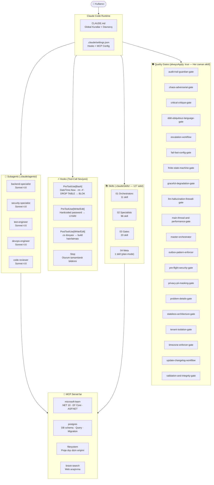
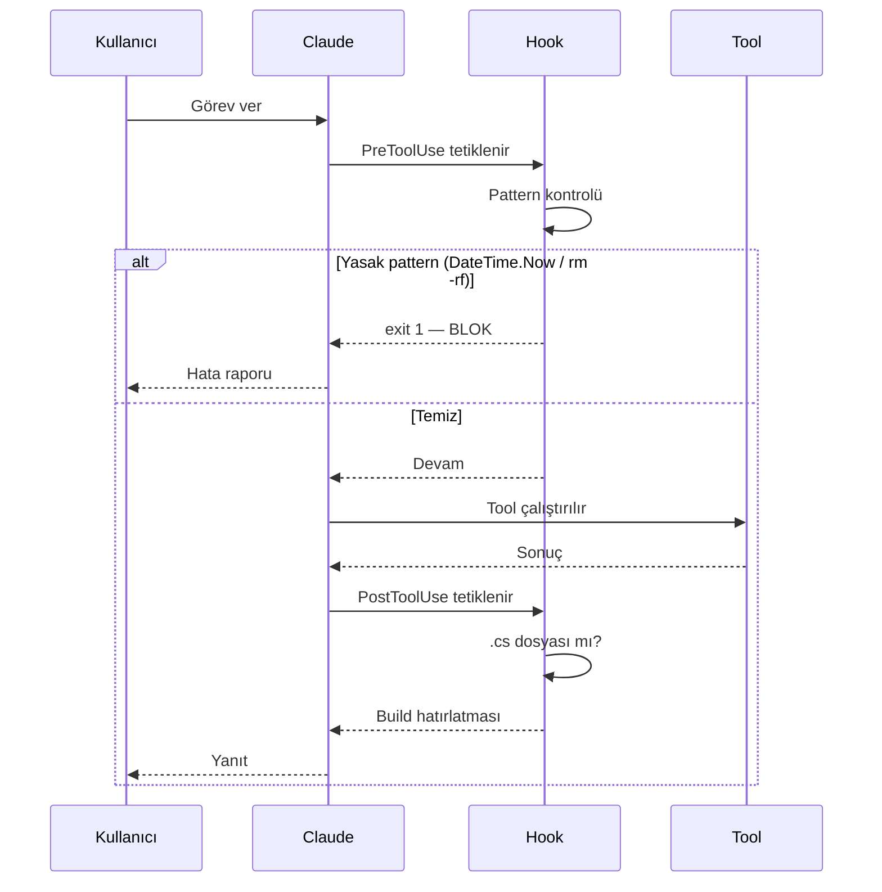
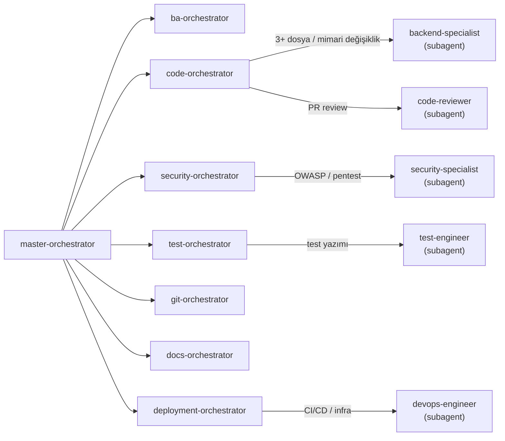
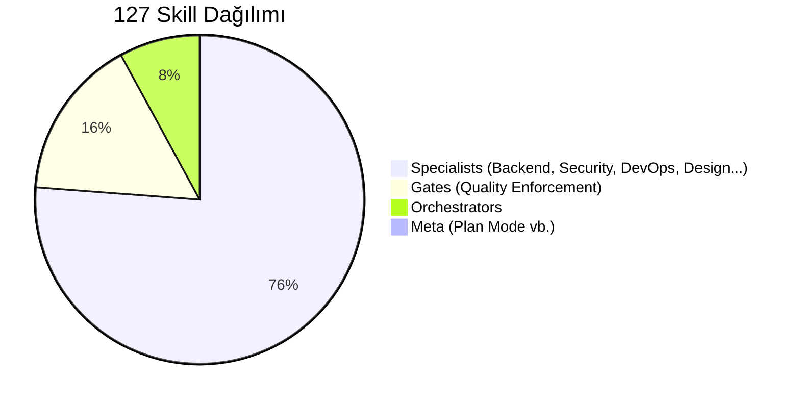
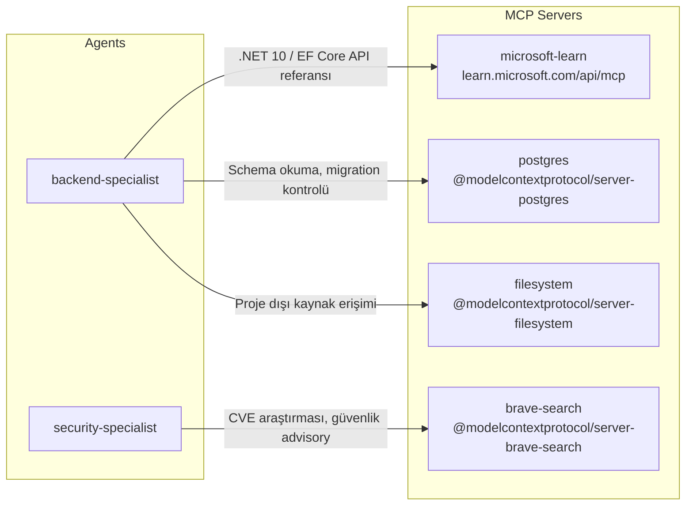

# Claude Agency — Mimari ve Sistem Diyagramı

## Genel Bakış

```mermaid
graph TB
    User(["👤 Kullanıcı"])

    subgraph CC["Claude Code Runtime"]
        CLAUDE["CLAUDE.md\nGlobal Kurallar + Davranış"]
        SETTINGS[".claude/settings.json\nHooks + MCP Config"]
    end

    subgraph GATES["🛡️ Quality Gates (alwaysApply: true — Her zaman aktif)"]
        G1["audit-trail-guardian-gate"]
        G2["chaos-adversarial-gate"]
        G3["critical-critique-gate"]
        G4["ddd-ubiquitous-language-gate"]
        G5["escalation-workflow"]
        G6["fail-fast-config-gate"]
        G7["finite-state-machine-gate"]
        G8["graceful-degradation-gate"]
        G9["llm-hallucination-firewall-gate"]
        G10["main-thread-and-performance-gate"]
        G11["master-orchestrator"]
        G12["outbox-pattern-enforcer"]
        G13["pre-flight-security-gate"]
        G14["privacy-pii-masking-gate"]
        G15["problem-details-gate"]
        G16["stateless-architecture-gate"]
        G17["tenant-isolation-gate"]
        G18["timezone-enforcer-gate"]
        G19["update-changelog-workflow"]
        G20["validation-and-integrity-gate"]
    end

    subgraph AGENTS["🤖 Subagents (.claude/agents/)"]
        A1["backend-specialist\nSonnet 4.6"]
        A2["security-specialist\nSonnet 4.6"]
        A3["test-engineer\nSonnet 4.6"]
        A4["devops-engineer\nSonnet 4.6"]
        A5["code-reviewer\nSonnet 4.6"]
    end

    subgraph HOOKS["⚡ Hooks (Tool-Call Seviyesi)"]
        H1["PreToolUse[Bash]\nDateTime.Now · rm -rf · DROP TABLE → BLOK"]
        H2["PreToolUse[Write/Edit]\nHardcoded password → UYARI"]
        H3["PostToolUse[Write/Edit]\n.cs dosyası → build hatırlatması"]
        H4["Stop\nOturum tamamlandı bildirimi"]
    end

    subgraph MCP["🔌 MCP Server'lar"]
        M1["microsoft-learn\n.NET 10 · EF Core · ASP.NET"]
        M2["postgres\nDB schema · Query · Migration"]
        M3["filesystem\nProje dışı dizin erişimi"]
        M4["brave-search\nWeb araştırma"]
    end

    subgraph SKILLS["📚 Skills (.claude/skills/ — 127 adet)"]
        S1["01 Orchestrators\n11 skill"]
        S2["02 Specialists\n96 skill"]
        S3["03 Gates\n20 skill"]
        S4["04 Meta\n1 skill (plan-mode)"]
    end

    User --> CC
    CC --> GATES
    CC --> AGENTS
    CC --> HOOKS
    CC --> SKILLS
    AGENTS --> MCP
    SKILLS --> MCP
```

---

## Hook Akış Diyagramı

```mermaid
sequenceDiagram
    participant U as Kullanıcı
    participant C as Claude
    participant H as Hook
    participant T as Tool

    U->>C: Görev ver
    C->>H: PreToolUse tetiklenir
    H->>H: Pattern kontrolü
    alt Yasak pattern (DateTime.Now / rm -rf)
        H-->>C: exit 1 — BLOK
        C-->>U: Hata raporu
    else Temiz
        H-->>C: Devam
        C->>T: Tool çalıştırılır
        T-->>C: Sonuç
        C->>H: PostToolUse tetiklenir
        H->>H: .cs dosyası mı?
        H-->>C: Build hatırlatması
        C-->>U: Yanıt
    end
```

---

## Agent Delegasyon Haritası

```mermaid
graph LR
    MO["master-orchestrator"] --> BA["ba-orchestrator"]
    MO --> CO["code-orchestrator"]
    MO --> SO["security-orchestrator"]
    MO --> TO["test-orchestrator"]
    MO --> GO["git-orchestrator"]
    MO --> DO["docs-orchestrator"]
    MO --> DEP["deployment-orchestrator"]

    CO -->|"3+ dosya / mimari değişiklik"| BS["backend-specialist\n(subagent)"]
    SO -->|"OWASP / pentest"| SS["security-specialist\n(subagent)"]
    TO -->|"test yazımı"| TE["test-engineer\n(subagent)"]
    DEP -->|"CI/CD / infra"| DE["devops-engineer\n(subagent)"]
    CO -->|"PR review"| CR["code-reviewer\n(subagent)"]
```

---

## Skill Kategorileri

```mermaid
pie title 127 Skill Dağılımı
    "Specialists (Backend, Security, DevOps, Design...)" : 96
    "Gates (Quality Enforcement)" : 20
    "Orchestrators" : 10
    "Meta (Plan Mode vb.)" : 1
```

---

## MCP Veri Akışı

```mermaid
graph LR
    subgraph Agents
        BS["backend-specialist"]
        SS["security-specialist"]
    end

    subgraph MCP Servers
        ML["microsoft-learn\nlearn.microsoft.com/api/mcp"]
        PG["postgres\n@modelcontextprotocol/server-postgres"]
        FS["filesystem\n@modelcontextprotocol/server-filesystem"]
        BV["brave-search\n@modelcontextprotocol/server-brave-search"]
    end

    BS -->|".NET 10 / EF Core API referansı"| ML
    BS -->|"Schema okuma, migration kontrolü"| PG
    SS -->|"CVE araştırması, güvenlik advisory"| BV
    BS -->|"Proje dışı kaynak erişimi"| FS
```
