# Claude Agency — Mimari ve Sistem Diyagramı

> Son güncelleme: 2026-09-18 — 139 Skill, 38 Subagent, 28 Kalite Kapısı, Graphify, Playwright MCP ve Hook kuralları entegre edildi.

---

## Genel Akış

```mermaid
graph TB
    User(["👤 Kullanıcı"])

    subgraph CC["Claude Code Runtime"]
        CLAUDE["CLAUDE.md\nGlobal Kurallar + Davranış"]
        SETTINGS[".claude/settings.json\nHooks + MCP Config"]
    end

    subgraph HOOKS["🔒 Hooks (Tool-Call Seviyesi)"]
        H1["PreToolUse[Bash]\nDATETIME / rm-rf / DROP TABLE / Thread.Sleep / .Result / .Wait → BLOK"]
        H2["PreToolUse[Write|Edit]\nAynı pattern + hardcoded secret → UYARI"]
        H3["PreToolUse[Bash|Grep]\nGraphify hook-guard search"]
        H4["PostToolUse[Write|Edit]\n.cs yazıldı → dotnet build hatırlatması"]
        H5["Stop\nOturum kapandı bildirimi"]
    end

    subgraph GATES["🛡️ Kalite Kapıları (28x Gate)"]
        G1["TDD · Clean Code · Anti-Sycophancy · Adversarial Review"]
        G2["PII Masking · Structured Logging · Hallucination Firewall"]
        G3["Dependency Audit · Secret Scan · Pre-Flight Security"]
        G4["Tenant Isolation · Stateless Arch · Problem Details"]
        G5["Graceful Degradation · Socratic Gate · Fail-Fast"]
    end

    subgraph AGENTS["🤖 Subagentlar (38 Uzman Ajan)"]
        A1["Teknik (7): backend, frontend, mobile, db-optimizer, devops, gis, webhook"]
        A2["Kalite & Güvenlik (9): code-reviewer, test-eng, qa-eng, security, incident..."]
        A3["Ürün & Tasarım (9): pm, sprint, feedback, ui, ux, brand, persona..."]
        A4["Strateji & Destek (8): strategy, okr, research, marketing, support..."]
        A5["Özel (5): focus-manager, reality-checker, tech-writer..."]
    end

    subgraph MCP["🔌 MCP Serverlar"]
        M1["microsoft-learn\n.NET resmi docs"]
        M2["playwright\nE2E test + browser"]
        M3["postgres\nDB schema + query"]
        M4["filesystem\nProje dışı erişim"]
        M5["brave-search\nCVE + web arama"]
    end

    subgraph SKILLS["⚙️ Skill Kataloğu (139)"]
        S1["11x Orkestratör (master, code, security, test, design...)"]
        S2["62x Uzmanlık (dotnet, swift, clean-code, pentest...)"]
        S3["28x Sert Kalite Kapısı"]
        S4["38x Araç & Meta (graphify, caveman, docs, office...)"]
    end

    User --> CC
    CC --> HOOKS
    HOOKS --> GATES
    GATES --> AGENTS
    AGENTS --> MCP
    CC --> SKILLS
```



---

## Delegasyon Eşiği

Aşağıdakilerden **biri** varsa doğrudan yanıtlama — subagent'a delege et:

| Koşul | Eşik | Örnek |
|---|---|---|
| Dosya Değişikliği | 3+ dosya | Yeni modül veya servis ekleme |
| Katman / Servis | Yeni mimari bileşen | Domain entity + repository + handler |
| Domain Uzmanlığı | Özel bilgi gerektiren alan | Güvenlik açığı, test stratejisi, bulut altyapısı |
| Tahmini Süre | 10+ dakika | CI/CD pipeline kurulumu, refactoring |

---

## Hook Doğrulama

Tüm hook'lar test edilmiş ve aktif enforce edilmektedir:

| Hook | Pattern | Sonuç |
|---|---|---|
| `PreToolUse[Bash]` | `DateTime.Now[^O]` | BLOK (Timezone-unsafe) |
| `PreToolUse[Bash]` | `rm -rf` | BLOK (Geri alınamaz silme) |
| `PreToolUse[Bash]` | `DROP TABLE` | BLOK (Veri kaybı riski) |
| `PreToolUse[Bash]` | `Thread\.Sleep` | BLOK (Blocking; `await Task.Delay` kullan) |
| `PreToolUse[Bash]` | `\.(Result\|Wait)\b` | BLOK (Sync-over-async deadlock) |
| `PreToolUse[Write\|Edit]` | `DateTime.Now` | UYARI |
| `PreToolUse[Write\|Edit]` | `(password\|secret\|token)\s*=\s*"[^"]+"` | UYARI (Hardcoded credential) |
| `PreToolUse[Write\|Edit]` | `Password=[^;>"]+` | UYARI (Connection string secret) |

---

## Graphify Entegrasyonu

```bash
graphify . --code-only        # API key gerektirmez — AST bazlı
graphify .                    # Kod + doc (ANTHROPIC_API_KEY gerekli)
graphify update .             # Kod değişikliği sonrası incremental
graphify query "soru"         # Doğal dil codebase sorusu
graphify path "A" "B"         # İki sembol arası ilişki zinciri
graphify explain "kavram"     # Odaklı modül açıklaması
```

---

## 🚫 Reddedilen Yaklaşımlar ve Standartlar

| Yasak Yaklaşım | Kabul Edilen Alternatif | Teknik Gerekçe |
|---|---|---|
| `DateTime.Now` | `DateTimeOffset.UtcNow` | Timezone belirsizliği ve UTC standardı ihlali |
| `task.Result` / `task.Wait()` | `await task` | Thread havuzu tükenmesi ve sync-over-async deadlock |
| `Thread.Sleep` | `await Task.Delay` | OS thread'ini gereksiz yere kilitleme |
| Hardcoded secret/şifre | `IOptions<T>` + Environment variables | Güvenlik açığı ve credential sızıntısı |
| Mock DB ile test | TestContainers (Gerçek DB) | Mock ortamın prodüksiyon davranışından sapması |
| `latest` Docker tag | Semantic versioning (`:9.0-alpine`) | Tekrarlanabilirlik ve sürüm kararsızlığı |
| DataAnnotations tek başına | `IPipelineBehavior` + FluentValidation | MediatR pipeline bypass riski |
| `CreatedAtAction(nameof(Create))` | `CreatedAtAction(nameof(GetById))` | Yanlış HTTP metot yönlendirmesi (REST 405 hatası) |
| `DateTimeOffset` non-nullable `ModifiedAt` | `DateTimeOffset?` | Başlangıçta 0001-01-01 epoch tarih bug'ı |
| xUnit 2.x + runner 3.x karışık | Aynı major.minor versiyon | `xunit.abstractions` yükleme hatası |
| Doğrulanmamış LLM çıktısı parse | Strict Schema Validation | Hallucination ve injection riski |
| Truncation / placeholder (`...`) | Eksiksiz tam çıktı | Eksik parantez, kayıp import ve syntax hataları |
