# Claude Agency — Mimari ve Sistem Diyagramı

> Son güncelleme: 2026-09-15 — Graphify, Playwright MCP, güncel hook regex'leri, subagent araçları eklendi.

## Genel Akış

```mermaid
graph TB
    User(["👤 Kullanıcı"])

    subgraph CC["Claude Code Runtime"]
        CLAUDE["CLAUDE.md\nGlobal Kurallar + Davranış"]
        SETTINGS[".claude/settings.json\nHooks + MCP Config"]
    end

    subgraph HOOKS["🔒 Hooks"]
        H1["PreToolUse[Bash]\nDATETIME / rm-rf / DROP TABLE / Thread.Sleep / .Result / .Wait → BLOK"]
        H2["PreToolUse[Write|Edit]\nAynı pattern + hardcoded secret → UYARI"]
        H3["PreToolUse[Bash|Grep]\nGraphify hook-guard search"]
        H4["PostToolUse[Write|Edit]\n.cs yazıldı → dotnet build hatırlatması"]
        H5["Stop\nOturum kapandı bildirimi"]
    end

    subgraph GATES["🛡️ Quality Gates (20x alwaysApply: true)"]
        G1["audit-trail-guardian · timezone-enforcer · privacy-pii-masking"]
        G2["tenant-isolation · pre-flight-security · fail-fast-config"]
        G3["validation-and-integrity · stateless-architecture · problem-details"]
        G4["finite-state-machine · outbox-pattern-enforcer · ddd-ubiquitous-language"]
        G5["structured-logging-audit · chaos-adversarial · graceful-degradation"]
        G6["llm-hallucination-firewall · main-thread-and-performance"]
        G7["critical-critique · update-changelog · escalation-workflow"]
    end

    subgraph AGENTS["🤖 Subagentlar (Sonnet 4.6)"]
        A1["backend-specialist\n.NET 10, EF Core, CQRS, MediatR"]
        A2["security-specialist\nOWASP, JWT, CVE — WebFetch dahil"]
        A3["test-engineer\nxUnit, FluentValidation, TestContainers — Agent tool dahil"]
        A4["devops-engineer\nDockerfile alpine, GitHub Actions, Trivy"]
        A5["code-reviewer\nRead-only, satır numaralı bulgular"]
    end

    subgraph MCP["🔌 MCP Serverlar"]
        M1["microsoft-learn\n.NET 10 resmi docs"]
        M2["playwright\nE2E test + browser otomasyon"]
        M3["postgres\nDB schema + query (env)"]
        M4["filesystem\nProje dışı erişim (env)"]
        M5["brave-search\nCVE + web arama (env)"]
    end

    subgraph SKILLS["⚙️ Skill Kataloğu (139)"]
        S1["plan-mode → native EnterPlanMode/ExitPlanMode"]
        S2["graphify → knowledge graph sorgu/üret"]
        S3["caveman, compress, commit, stats"]
        S4["62 domain skill (.NET, API, güvenlik, test, DevOps)"]
    end

    User --> CC
    CC --> HOOKS
    HOOKS --> GATES
    GATES --> AGENTS
    AGENTS --> MCP
    CC --> SKILLS
```



## Delegasyon Eşiği

Aşağıdakilerden **biri** varsa doğrudan yanıtlama — subagent'a delege et:

| Koşul | Örnek |
|---|---|
| 3+ dosya değişikliği | Yeni modül ekleme |
| Yeni servis / katman | Domain entity + repository + handler |
| Domain uzmanlığı | Güvenlik açığı, test stratejisi, infra |
| Tahminen 10+ dakika | CI pipeline kurulumu |

## Hook Doğrulama

Tüm hook'lar 2026-09-14'te 8/8 senaryoda test edildi:

| Hook | Pattern | Doğrulandı |
|---|---|---|
| PreToolUse[Bash] | `DateTime.Now[^O]` | ✓ |
| PreToolUse[Bash] | `rm -rf` | ✓ |
| PreToolUse[Bash] | `DROP TABLE` | ✓ |
| PreToolUse[Bash] | `Thread\.Sleep` | ✓ |
| PreToolUse[Bash] | `\.(Result\|Wait)\b` | ✓ |
| PreToolUse[Write\|Edit] | `DateTime.Now` | ✓ |
| PreToolUse[Write\|Edit] | `(password\|secret\|token)\s*=\s*"[^"]+"` | ✓ |
| PreToolUse[Write\|Edit] | `Password=[^;>"]+` | ✓ |

## Graphify Entegrasyonu

```
graphify . --code-only        # API key gerektirmez — AST bazlı
graphify .                    # Kod + doc (ANTHROPIC_API_KEY gerekli)
graphify update .             # Kod değişikliği sonrası incremental
graphify query "soru"         # Doğal dil codebase sorusu
graphify path "A" "B"         # İki sembol arası ilişki
graphify explain "kavram"     # Odaklı modül açıklaması
```

Graph çıktısı `graphify-out/` altında. Broad analiz için `graphify-out/GRAPH_REPORT.md` yerine önce `query`/`path`/`explain` kullan — token maliyeti çok daha düşük.

## Reddedilen Yaklaşımlar

| Yasak | Alternatif |
|---|---|
| `DateTime.Now` | `DateTimeOffset.UtcNow` |
| `task.Result` / `.Wait()` | `await task` |
| `Thread.Sleep` | `await Task.Delay` |
| Hardcoded secret | `IOptions<T>` + env var |
| Mock DB test | TestContainers (real DB) |
| `latest` Docker tag | Semantic versioning |
| DataAnnotations ile MediatR validation | `IPipelineBehavior` + FluentValidation |
| `CreatedAtAction(nameof(Create))` POST referansı | `CreatedAtAction(nameof(GetById))` GET referansı |
| `DateTimeOffset` non-nullable ModifiedAt | `DateTimeOffset?` (0001-01-01 bug'ı) |
