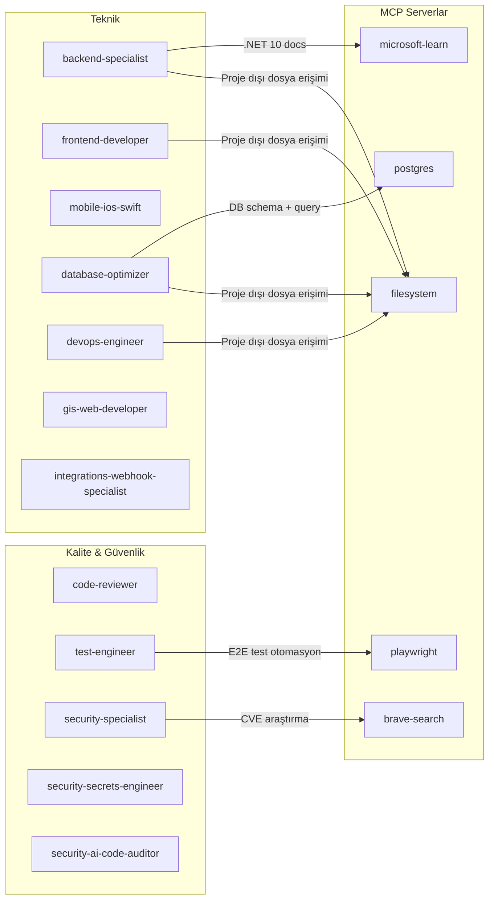
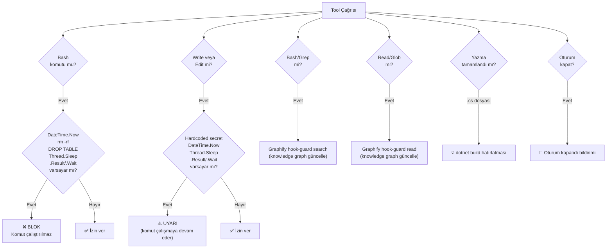
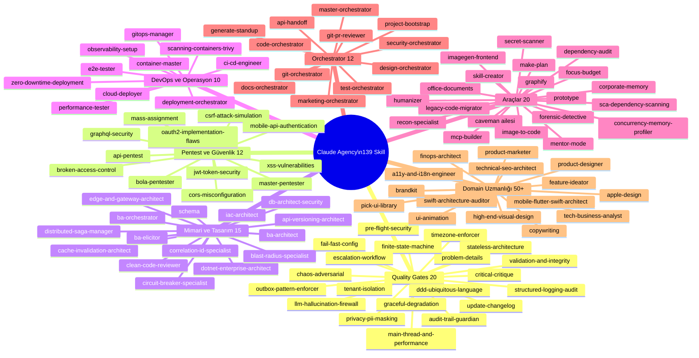

# Claude Agency — Tam Sistem Akış Diyagramı

> Son güncelleme: 2026-09-18 — 38 agent, 139 skill, 5 MCP server, 4 hook katmanı

## Ana Sistem Akışı

```mermaid
flowchart TD
    USER(["👤 Kullanıcı\nİstek / Soru / Görev"])

    subgraph ENTRY["🚪 Giriş Katmanı"]
        CLAUDE["CLAUDE.md\nGlobal Kurallar\nDelegasyon Haritası\nReddedilen Yaklaşımlar"]
    end

    subgraph HOOK_PRE["🔒 PreToolUse Hooks"]
        HB["Bash Hook\n──────────────\nDateTime.Now → BLOK\nrm -rf → BLOK\nDROP TABLE → BLOK\nThread.Sleep → BLOK\n.Result / .Wait → BLOK"]
        HWE["Write/Edit Hook\n──────────────\nDateTime.Now → UYARI\nhardcoded secret → UYARI\nThread.Sleep → UYARI\n.Result / .Wait → UYARI"]
        HGQ["Bash/Grep Hook\nGraphify hook-guard\nsearch"]
        HRD["Read/Glob Hook\nGraphify hook-guard\nread"]
    end

    subgraph HOOK_POST["📤 PostToolUse & Stop Hooks"]
        HPW["Write/Edit Post\n.cs yazıldı →\ndotnet build hatırlatması"]
        HSTOP["Stop Hook\nOturum kapandı\nbildirim"]
    end

    subgraph GATES["🛡️ Quality Gates — 20 Gate, alwaysApply: true"]
        direction LR
        subgraph GATES_DB["Veri & Zaman"]
            G1["audit-trail-guardian\nCreatedBy + ModifiedAt zorunlu"]
            G2["timezone-enforcer\nDateTimeOffset.UtcNow zorunlu"]
            G3["privacy-pii-masking\nŞifre/TCKN/CC log yasak"]
        end
        subgraph GATES_ARCH["Mimari"]
            G4["tenant-isolation\nTenantId filtresi zorunlu"]
            G5["stateless-architecture\nSession yasak · JWT zorunlu"]
            G6["finite-state-machine\nKritik durum → FSM"]
            G7["outbox-pattern-enforcer\nEvent → outbox zorunlu"]
            G8["ddd-ubiquitous-language\nDomain dili tutarlılığı"]
        end
        subgraph GATES_SEC["Güvenlik & Kalite"]
            G9["pre-flight-security\nKod öncesi blueprint"]
            G10["fail-fast-config\nApp başlangıcı config doğrulama"]
            G11["validation-and-integrity\n3-tier: DB→FluentValidation→Client"]
            G12["problem-details\nRFC 7807 hata formatı"]
            G13["llm-hallucination-firewall\nLLM çıktısı → doğrula"]
        end
        subgraph GATES_OPS["Operasyon"]
            G14["structured-logging-audit\nAsync exception · audit trail"]
            G15["chaos-adversarial\nTimeout/503/null senaryoları"]
            G16["graceful-degradation\nServis düşerse fallback zorunlu"]
            G17["main-thread-and-performance\nUI thread blocking yasak"]
        end
        subgraph GATES_PROC["Süreç"]
            G18["critical-critique\nHer çözümde alternatif + risk"]
            G19["update-changelog\nHer değişiklikte CHANGELOG"]
            G20["escalation-workflow\nKritik karar → eskalasyon"]
        end
    end

    subgraph DECISION["⚖️ Delegasyon Kararı"]
        D1{"3+ dosya\ndeğişikliği?"}
        D2{"Yeni servis/\nmodül/katman?"}
        D3{"Domain\nuzmanlığı\ngerekli?"}
        D4{"10+ dakika\nsürecek?"}
        DIRECT["Doğrudan Yanıt\n(ana context)"]
        DELEGATE["Subagent'a Delege"]
    end

    subgraph AGENTS_TECH["🔧 Teknik Agentlar"]
        AT1["backend-specialist\n.NET 10 · EF Core 9 · CQRS\nMediatR · Clean Architecture\nTools: Read Edit Write Bash"]
        AT2["frontend-developer\nReact 19+ · TypeScript strict\nTailwind · Core Web Vitals\nTools: Read Edit Write Bash"]
        AT3["mobile-ios-swift\nSwift 6.1 · SwiftUI 6\nwatchOS 11+ · Swift Data\nTools: Read Edit Write Bash"]
        AT4["database-optimizer\nPostgreSQL 17 · EF Core 9\nQuery opt · Zero-downtime migration\nTools: Read Edit Write Bash"]
        AT5["devops-engineer\nGitHub Actions · Docker · K8s\nTerraform · Azure/AWS\nTools: Read Edit Write Bash"]
        AT6["gis-web-developer\nMapLibre GL · Leaflet · Deck.gl\nWebSocket konum takibi\nTools: Read Edit Write Bash"]
        AT7["integrations-webhook-specialist\nHMAC imzalama · Idempotency\nEvent-driven entegrasyon\nTools: Read Edit Write Bash"]
    end

    subgraph AGENTS_QS["🛡️ Kalite & Güvenlik Agentları"]
        AQ1["code-reviewer\nSatır numaralı bulgular\nRead-only · CRITICAL/WARN/INFO\nTools: Read Bash"]
        AQ2["test-engineer\nxUnit · NUnit · TestContainers\nPlaywright · k6\nTools: Read Edit Write Bash"]
        AQ3["testing-qa-engineer\nTest senaryosu · Edge case\nAcceptance criteria\nTools: Read Write Edit Bash"]
        AQ4["testing-test-strategist\nTest piramidi · Araç seçimi\nCI/CD test entegrasyonu\nTools: Read Write"]
        AQ5["security-specialist\nOWASP Top 10 · STRIDE\nJWT/OAuth2 · AI kod denetimi\nTools: Read Bash WebSearch WebFetch"]
        AQ6["security-secrets-engineer\nCredential yönetimi · Secret tespiti\nKey rotation · .env güvenliği\nTools: Read Bash"]
        AQ7["security-compliance-auditor\nGDPR · App Store PrivacyInfo\nVeri saklama politikası\nTools: Read Write"]
        AQ8["security-ai-code-auditor\nClaude/Copilot/Cursor kod denetimi\nHallüsinasyon kaynaklı paket doğrulama\nTools: Read Bash"]
        AQ9["incident-response\nSEV sınıflandırması · 5 Whys RCA\nBlameless postmortem · Runbook\nTools: Read Bash"]
    end

    subgraph AGENTS_PD["🎨 Ürün & Tasarım Agentları"]
        AP1["product-manager\nPRD · RICE önceliklendirme\nRoadmap · Feature decision\nTools: Read Write Edit"]
        AP2["product-sprint-prioritizer\nSprint kapasitesi · Backlog sıralama\nTools: Read Write"]
        AP3["product-feedback-synthesizer\nApp Store yorumları · Ticket analizi\nAnket sentezi\nTools: Read Write"]
        AD1["design-ui-designer\nApple HIG · Görsel hiyerarşi\nErişilebilirlik\nTools: Read Write Edit"]
        AD2["design-ux-architect\nKullanıcı akışı · Bilgi mimarisi\nNavigasyon yapısı\nTools: Read Write"]
        AD3["design-ux-researcher\nKullanıcı araştırması · Görüşme\nBulgular raporu\nTools: Read Write"]
        AD4["design-ui-finish-gate-reviewer\nSpacing · Durum kapsamı\nErişilebilirlik · Platform uyumu\nTools: Read"]
        AD5["design-brand-guardian\nGörsel kimlik · Ses tonu\nTutarlılık denetimi\nTools: Read"]
        AD6["design-persona-walkthrough\nPersona bazlı UX senaryosu\nTools: Read"]
    end

    subgraph AGENTS_PS["📋 Proje & Strateji Agentları"]
        AS1["project-manager-senior\nSprint planı · Risk yönetimi\nMilestone takibi · Durum raporu\nTools: Read Write"]
        AS2["meeting-notes-specialist\nToplantı notları yapılandırma\nKarar + aksiyon maddeleri\nTools: Read Write"]
        AS3["strategy-business-strategist\nBüyüme · Monetizasyon\nSWOT/RICE/Ansoff analizi\nTools: Read Write"]
        AS4["strategy-okr-coach\nOKR yazımı · Quarter planlaması\nÇok proje kapasite dengesi\nTools: Read Write"]
        AS5["research-synthesizer\nÇoklu kaynak sentezi\nRakip analizi · Araştırma raporu\nTools: Read Write"]
    end

    subgraph AGENTS_MK["📣 Pazarlama & Destek Agentları"]
        AM1["marketing-content-strategist\nApp Store metni · Release notes\nTeknik blog · Developer içeriği\nTools: Read Write"]
        AM2["marketing-seo-specialist\nASO · Web SEO\nAnahtar kelime araştırması\nTools: Read Write"]
        AM3["marketing-copywriter\nPazarlama kopyası · Onboarding\nPush notification · CTA\nTools: Read Write"]
        AM4["support-technical-support\nKullanıcı sorun çözme\nFAQ · Destek dokümanı\nTools: Read Write"]
        AM5["support-customer-support\nApp Store yorum yanıtı\nEmpati · Şikayet yönetimi\nTools: Write"]
        AM6["technical-writer\nAPI dokümantasyonu · README\nMimari belgeler · Dev guide\nTools: Read Write Edit"]
    end

    subgraph AGENTS_DS["🔎 Karar Destek Agentları"]
        ADC1["specialized-reality-checker\nPlan/fikir varsayım testi\nKör nokta tespiti\nTools: Read"]
        ADC2["specialized-focus-manager\nÇok proje önceliklendirme\nHaftalık odak planı\nTools: Read Write"]
    end

    subgraph MCP["🔌 MCP Serverlar"]
        MC1["microsoft-learn\nhttps://learn.microsoft.com/api/mcp\n.NET 10 · EF Core · ASP.NET Core"]
        MC2["playwright\n@playwright/mcp\nE2E test · Browser otomasyon\nWeb scraping"]
        MC3["postgres\n@modelcontextprotocol/server-postgres\nDB schema · Query · Migration\n[POSTGRES_CONNECTION_STRING]"]
        MC4["filesystem\n@modelcontextprotocol/server-filesystem\nProje dışı dizin erişimi\n[PROJECT_ROOT]"]
        MC5["brave-search\n@modelcontextprotocol/server-brave-search\nCVE araştırma · Web arama\n[BRAVE_API_KEY]"]
    end

    subgraph SKILLS["⚙️ Skill Kataloğu — 139 Skill"]
        SK1["Quality Gates (20)\naudit-trail · timezone · privacy\ntenant · security · config\nvalidation · stateless · fsm\noutbox · ddd · logging\nchaos · degradation · hallucination\nperformance · critique · changelog\nescalation · problem-details"]
        SK2["Pentest & Güvenlik (12)\napi-pentest · master-pentester\napi-authentication · bola\nmass-assignment · xss · csrf\njwt · cors · oauth2\nmobile-auth · graphql-security"]
        SK3["Mimari & Tasarım (15)\ndotnet-enterprise-architect\nclean-code-reviewer\napi-versioning · cache-invalidation\ncircuit-breaker · distributed-saga\nedge-gateway · iac-architect\nfinite-state-machine · outbox\nsaga · schema · ba-orchestrator\nba-architect · ba-elicitor"]
        SK4["DevOps & Ops (10)\nci-cd-engineer · container-master\ncloud-deployer · gitops-manager\ndeployment-orchestrator\nobservability-setup\nzero-downtime-deployment\nscanning-containers\nperformance-tester · e2e-tester"]
        SK5["Araçlar (20)\ngraphify · caveman ailesi\nfocus-budget · corporate-memory\nimage-to-code · office-documents\nhumanizer · mentor-mode\nmake-plan · skill-creator\nmcp-builder · prototype\nblast-radius · forensic-detective\nrecon-specialist · imagegen-frontend"]
        SK6["Orchestrator (12)\nmaster-orchestrator\ncode-orchestrator · test-orchestrator\ndesign-orchestrator · docs-orchestrator\nmarketing-orchestrator\nsecurity-orchestrator\nproject-bootstrap\napi-handoff · generate-standup\ngit-pr-reviewer · git-orchestrator"]
        SK7["Domain (50+)\nswift-architecture · mobile-flutter\napple-design · ui-animation\ncopywriting · brandkit\ntechnical-seo · pick-ui-library\nproduct-designer · product-marketer\ntech-business-analyst · feature-ideator\nlegacy-code-migrator\nconcurrency-memory-profiler\ndb-architect-security + diğerleri"]
    end

    subgraph GRAPHIFY["🗺️ Graphify — Codebase Knowledge Graph"]
        GR1["graphify . --code-only\nAST bazlı · API key gerektirmez"]
        GR2["graphify query 'soru'\nDoğal dil codebase sorusu"]
        GR3["graphify path A B\nİki sembol arası ilişki"]
        GR4["graphify explain 'kavram'\nOdaklı modül açıklaması"]
        GR5["graphify update .\nKod değişikliği sonrası incremental"]
        GRO["graphify-out/\ngraph.json · wiki/index.md\nGRAPH_REPORT.md"]
    end

    %% Ana akış
    USER --> ENTRY
    ENTRY --> HOOK_PRE
    HOOK_PRE --> HOOK_POST
    HOOK_PRE --> GATES

    GATES --> DECISION
    D1 -- Evet --> DELEGATE
    D2 -- Evet --> DELEGATE
    D3 -- Evet --> DELEGATE
    D4 -- Evet --> DELEGATE
    D1 -- Hayır --> D2
    D2 -- Hayır --> D3
    D3 -- Hayır --> D4
    D4 -- Hayır --> DIRECT

    DELEGATE --> AGENTS_TECH
    DELEGATE --> AGENTS_QS
    DELEGATE --> AGENTS_PD
    DELEGATE --> AGENTS_PS
    DELEGATE --> AGENTS_MK
    DELEGATE --> AGENTS_DS

    %% Agent → MCP bağlantıları
    AGENTS_TECH --> MCP
    AGENTS_QS --> MCP
    AQ5 -->|"brave-search\nCVE araştırma"| MC5
    AT1 -->|"microsoft-learn\n.NET docs"| MC1
    AT4 -->|"postgres\nDB schema"| MC3
    AQ2 -->|"playwright\nE2E test"| MC2

    %% Skill kullanımı
    ENTRY --> SKILLS
    SKILLS --> GRAPHIFY
    GRAPHIFY --> GRO

    %% Stil
    classDef hookStyle fill:#dc2626,color:#fff,stroke:#991b1b
    classDef gateStyle fill:#d97706,color:#fff,stroke:#92400e
    classDef agentStyle fill:#2563eb,color:#fff,stroke:#1d4ed8
    classDef mcpStyle fill:#059669,color:#fff,stroke:#065f46
    classDef skillStyle fill:#7c3aed,color:#fff,stroke:#5b21b6
    classDef graphStyle fill:#0891b2,color:#fff,stroke:#0e7490
    classDef decisionStyle fill:#374151,color:#fff,stroke:#1f2937

    class HB,HWE,HGQ,HRD,HPW,HSTOP hookStyle
    class G1,G2,G3,G4,G5,G6,G7,G8,G9,G10,G11,G12,G13,G14,G15,G16,G17,G18,G19,G20 gateStyle
    class AT1,AT2,AT3,AT4,AT5,AT6,AT7 agentStyle
    class AQ1,AQ2,AQ3,AQ4,AQ5,AQ6,AQ7,AQ8,AQ9 agentStyle
    class AP1,AP2,AP3,AD1,AD2,AD3,AD4,AD5,AD6 agentStyle
    class AS1,AS2,AS3,AS4,AS5 agentStyle
    class AM1,AM2,AM3,AM4,AM5,AM6 agentStyle
    class ADC1,ADC2 agentStyle
    class MC1,MC2,MC3,MC4,MC5 mcpStyle
    class SK1,SK2,SK3,SK4,SK5,SK6,SK7 skillStyle
    class GR1,GR2,GR3,GR4,GR5,GRO graphStyle
    class D1,D2,D3,D4,DIRECT,DELEGATE decisionStyle
```

---

## Agent → MCP Bağımlılık Haritası

---

## Hook Karar Ağacı

---

## Skill Kategori Haritası

---

## Delegasyon Tetikleyici Haritası

```mermaid
graph TD
    REQ["Kullanıcı İsteği"]

    REQ --> CAT_T["Teknik Geliştirme"]
    REQ --> CAT_Q["Kalite & Güvenlik"]
    REQ --> CAT_P["Ürün & Tasarım"]
    REQ --> CAT_S["Proje & Strateji"]
    REQ --> CAT_M["Pazarlama & Destek"]
    REQ --> CAT_D["Karar Destek"]

    CAT_T --> T1[".NET · EF Core · CQRS\n→ backend-specialist"]
    CAT_T --> T2["React · TypeScript · UI\n→ frontend-developer"]
    CAT_T --> T3["Swift · SwiftUI · watchOS\n→ mobile-ios-swift"]
    CAT_T --> T4["PostgreSQL · Query · Migration\n→ database-optimizer"]
    CAT_T --> T5["CI/CD · Docker · K8s\n→ devops-engineer"]
    CAT_T --> T6["Harita · Güzergah · Konum\n→ gis-web-developer"]
    CAT_T --> T7["Webhook · Event-driven\n→ integrations-webhook-specialist"]

    CAT_Q --> Q1["PR Review · Kod kalitesi\n→ code-reviewer"]
    CAT_Q --> Q2["Unit/Integration/E2E Test\n→ test-engineer"]
    CAT_Q --> Q3["Test senaryosu · Edge case\n→ testing-qa-engineer"]
    CAT_Q --> Q4["Test stratejisi · Piramit\n→ testing-test-strategist"]
    CAT_Q --> Q5["OWASP · JWT · STRIDE · AI kod\n→ security-specialist"]
    CAT_Q --> Q6["Secret · Credential · .env\n→ security-secrets-engineer"]
    CAT_Q --> Q7["GDPR · App Store gizlilik\n→ security-compliance-auditor"]
    CAT_Q --> Q8["AI üretimi kod denetimi\n→ security-ai-code-auditor"]
    CAT_Q --> Q9["Production olayı · Postmortem\n→ incident-response"]

    CAT_P --> P1["PRD · Roadmap · Özellik kararı\n→ product-manager"]
    CAT_P --> P2["Sprint · Backlog önceliklendirme\n→ product-sprint-prioritizer"]
    CAT_P --> P3["Kullanıcı geri bildirimi analizi\n→ product-feedback-synthesizer"]
    CAT_P --> P4["UI tasarımı · HIG\n→ design-ui-designer"]
    CAT_P --> P5["Kullanıcı akışı · IA\n→ design-ux-architect"]
    CAT_P --> P6["Kullanıcı araştırması\n→ design-ux-researcher"]
    CAT_P --> P7["Ekran yayın kalite kontrolü\n→ design-ui-finish-gate-reviewer"]
    CAT_P --> P8["Marka tutarlılığı\n→ design-brand-guardian"]
    CAT_P --> P9["Persona bazlı UX walkthrough\n→ design-persona-walkthrough"]

    CAT_S --> S1["Sprint · Risk · Timeline\n→ project-manager-senior"]
    CAT_S --> S2["Toplantı notları\n→ meeting-notes-specialist"]
    CAT_S --> S3["Büyüme · Monetizasyon\n→ strategy-business-strategist"]
    CAT_S --> S4["OKR · Quarter planlaması\n→ strategy-okr-coach"]
    CAT_S --> S5["Araştırma sentezi\n→ research-synthesizer"]

    CAT_M --> M1["App Store · Release notes\n→ marketing-content-strategist"]
    CAT_M --> M2["ASO · SEO\n→ marketing-seo-specialist"]
    CAT_M --> M3["Pazarlama kopyası · CTA\n→ marketing-copywriter"]
    CAT_M --> M4["Teknik destek · FAQ\n→ support-technical-support"]
    CAT_M --> M5["App Store yorum yanıtı\n→ support-customer-support"]
    CAT_M --> M6["API dok · README · Dev guide\n→ technical-writer"]

    CAT_D --> D1["Plan · Fikir gerçeklik kontrolü\n→ specialized-reality-checker"]
    CAT_D --> D2["Çok proje odak planı\n→ specialized-focus-manager"]
```

