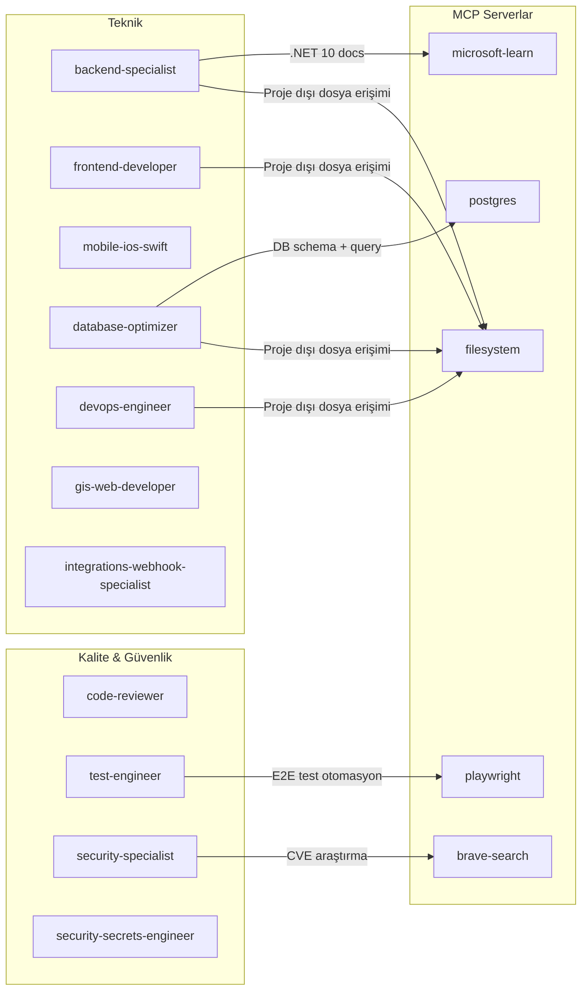
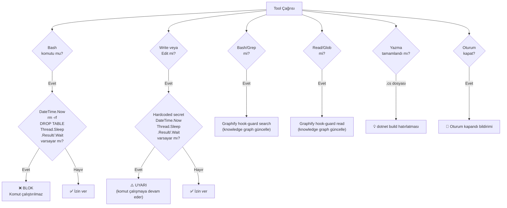
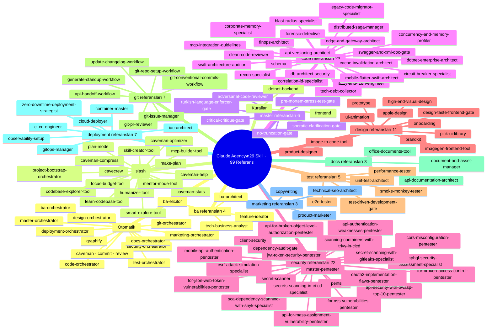

# Claude Agency — Tam Sistem Akış Diyagramı

> Son güncelleme: 2026-10-04 — 36 agent, 29 skill (99 referans), 2 kural dosyası, 5 MCP server, 4 hook katmanı

## Ana Sistem Akışı

```mermaid
flowchart TD
    USER(["👤 Kullanıcı\nİstek / Soru / Görev"])

    subgraph ENTRY["🚪 Giriş Katmanı"]
        CLAUDE["CLAUDE.md\nGlobal Kurallar\nDelegasyon Haritası\nReddedilen Yaklaşımlar"]
    end

    subgraph HOOK_PRE["🔒 PreToolUse Hooks"]
        HB["Bash Hook\n──────────────\nDateTime.Now → BLOK\nrm -rf → BLOK\nDROP TABLE → BLOK\nThread.Sleep → BLOK\n.Result / .Wait → BLOK"]
        HWE["Write/Edit Hook\n──────────────\nDateTime.Now → UYARI\nhardcoded secret → UYARI\nThread.Sleep → UYARI\n.Result / .Wait → UYARI"]
        HGQ["Bash/Grep Hook\nGraphify hook-guard\nsearch"]
        HRD["Read/Glob Hook\nGraphify hook-guard\nread"]
    end

    subgraph HOOK_POST["📤 PostToolUse & Stop Hooks"]
        HPW["Write/Edit Post\n.cs yazıldı →\ndotnet build hatırlatması"]
        HSTOP["Stop Hook\nOturum kapandı\nbildirim"]
    end

    subgraph GATES["🛡️ Kalite Kapıları — .claude/rules (path-scoped) + CLAUDE.md"]
        direction LR
        GR_CS["dotnet-backend.md · *.cs\nAudit · Tenant · UTC · FSM · Outbox\n3-tier doğrulama · IOptions · ProblemDetails\nStateless · PII log · Dayanıklılık"]
        GR_FE["frontend.md · ts/tsx/js/dart\nClient doğrulama · Graceful degradation\n60fps main thread · Bundle · LLM çıktı"]
        GR_GL["CLAUDE.md · her zaman\nPre-flight · Kritik itiraz\nEskalasyon · Changelog (release)"]
    end

    subgraph DECISION["⚖️ Delegasyon Kararı"]
        D1{"3+ dosya\ndeğişikliği?"}
        D2{"Yeni servis/\nmodül/katman?"}
        D3{"Domain\nuzmanlığı\ngerekli?"}
        D4{"10+ dakika\nsürecek?"}
        DIRECT["Doğrudan Yanıt\n(ana context)"]
        DELEGATE["Subagent'a Delege"]
    end

    subgraph AGENTS_TECH["🔧 Teknik Agentlar"]
        AT1["backend-specialist\n.NET 10 · EF Core 9 · CQRS\nMediatR · Clean Architecture\nTools: Read Edit Write Bash"]
        AT2["frontend-developer\nReact 19+ · TypeScript strict\nTailwind · Core Web Vitals\nTools: Read Edit Write Bash"]
        AT3["mobile-ios-swift\nSwift 6.1 · SwiftUI 6\nwatchOS 11+ · Swift Data\nTools: Read Edit Write Bash"]
        AT4["database-optimizer\nPostgreSQL 17 · EF Core 9\nQuery opt · Zero-downtime migration\nTools: Read Edit Write Bash"]
        AT5["devops-engineer\nGitHub Actions · Docker · K8s\nTerraform · Azure/AWS\nTools: Read Edit Write Bash"]
        AT6["gis-web-developer\nMapLibre GL · Leaflet · Deck.gl\nWebSocket konum takibi\nTools: Read Edit Write Bash"]
        AT7["integrations-webhook-specialist\nHMAC imzalama · Idempotency\nEvent-driven entegrasyon\nTools: Read Edit Write Bash"]
    end

    subgraph AGENTS_QS["🛡️ Kalite & Güvenlik Agentları"]
        AQ1["code-reviewer\nSatır numaralı bulgular\nRead-only · CRITICAL/WARN/INFO\nTools: Read Bash"]
        AQ2["test-engineer\nxUnit · NUnit · TestContainers\nPlaywright · k6\nTools: Read Edit Write Bash"]
        AQ4["testing-test-strategist\nTest piramidi · Araç seçimi\nCI/CD test entegrasyonu\nTools: Read Write"]
        AQ5["security-specialist\nOWASP Top 10 · STRIDE\nJWT/OAuth2 · AI kod denetimi\nTools: Read Bash WebSearch WebFetch"]
        AQ6["security-secrets-engineer\nCredential yönetimi · Secret tespiti\nKey rotation · .env güvenliği\nTools: Read Bash"]
        AQ7["security-compliance-auditor\nGDPR · App Store PrivacyInfo\nVeri saklama politikası\nTools: Read Write"]
        AQ9["incident-response\nSEV sınıflandırması · 5 Whys RCA\nBlameless postmortem · Runbook\nTools: Read Bash"]
    end

    subgraph AGENTS_PD["🎨 Ürün & Tasarım Agentları"]
        AP1["product-manager\nPRD · RICE önceliklendirme\nRoadmap · Feature decision\nTools: Read Write Edit"]
        AP2["product-sprint-prioritizer\nSprint kapasitesi · Backlog sıralama\nTools: Read Write"]
        AP3["product-feedback-synthesizer\nApp Store yorumları · Ticket analizi\nAnket sentezi\nTools: Read Write"]
        AD1["design-ui-designer\nApple HIG · Görsel hiyerarşi\nErişilebilirlik\nTools: Read Write Edit"]
        AD2["design-ux-architect\nKullanıcı akışı · Bilgi mimarisi\nNavigasyon yapısı\nTools: Read Write"]
        AD3["design-ux-researcher\nKullanıcı araştırması · Görüşme\nBulgular raporu\nTools: Read Write"]
        AD4["design-ui-finish-gate-reviewer\nSpacing · Durum kapsamı\nErişilebilirlik · Platform uyumu\nTools: Read"]
        AD5["design-brand-guardian\nGörsel kimlik · Ses tonu\nTutarlılık denetimi\nTools: Read"]
        AD6["design-persona-walkthrough\nPersona bazlı UX senaryosu\nTools: Read"]
    end

    subgraph AGENTS_PS["📋 Proje & Strateji Agentları"]
        AS1["project-manager-senior\nSprint planı · Risk yönetimi\nMilestone takibi · Durum raporu\nTools: Read Write"]
        AS2["meeting-notes-specialist\nToplantı notları yapılandırma\nKarar + aksiyon maddeleri\nTools: Read Write"]
        AS3["strategy-business-strategist\nBüyüme · Monetizasyon\nSWOT/RICE/Ansoff analizi\nTools: Read Write"]
        AS4["strategy-okr-coach\nOKR yazımı · Quarter planlaması\nÇok proje kapasite dengesi\nTools: Read Write"]
        AS5["research-synthesizer\nÇoklu kaynak sentezi\nRakip analizi · Araştırma raporu\nTools: Read Write"]
    end

    subgraph AGENTS_MK["📣 Pazarlama & Destek Agentları"]
        AM1["marketing-content-strategist\nApp Store metni · Release notes\nTeknik blog · Developer içeriği\nTools: Read Write"]
        AM2["marketing-seo-specialist\nASO · Web SEO\nAnahtar kelime araştırması\nTools: Read Write"]
        AM3["marketing-copywriter\nPazarlama kopyası · Onboarding\nPush notification · CTA\nTools: Read Write"]
        AM4["support-technical-support\nKullanıcı sorun çözme\nFAQ · Destek dokümanı\nTools: Read Write"]
        AM5["support-customer-support\nApp Store yorum yanıtı\nEmpati · Şikayet yönetimi\nTools: Write"]
        AM6["technical-writer\nAPI dokümantasyonu · README\nMimari belgeler · Dev guide\nTools: Read Write Edit"]
    end

    subgraph AGENTS_DS["🔎 Karar Destek Agentları"]
        ADC1["specialized-reality-checker\nPlan/fikir varsayım testi\nKör nokta tespiti\nTools: Read"]
        ADC2["specialized-focus-manager\nÇok proje önceliklendirme\nHaftalık odak planı\nTools: Read Write"]
    end

    subgraph MCP["🔌 MCP Serverlar"]
        MC1["microsoft-learn\nhttps://learn.microsoft.com/api/mcp\n.NET 10 · EF Core · ASP.NET Core"]
        MC2["playwright\n@playwright/mcp\nE2E test · Browser otomasyon\nWeb scraping"]
        MC3["postgres\n@modelcontextprotocol/server-postgres\nDB schema · Query · Migration\n[POSTGRES_CONNECTION_STRING]"]
        MC4["filesystem\n@modelcontextprotocol/server-filesystem\nProje dışı dizin erişimi\n[PROJECT_ROOT]"]
        MC5["brave-search\n@modelcontextprotocol/server-brave-search\nCVE araştırma · Web arama\n[BRAVE_API_KEY]"]
    end

    subgraph SKILLS["⚙️ Skill Katmanları — 29 skill · 99 referans"]
        SK1["Otomatik (14)\nmaster · code · security · design · test\ngit · docs · deployment · marketing · ba\ngraphify · caveman · caveman-commit · caveman-review"]
        SK2["Manuel / slash (16)\ncaveman-compress/stats/help · cavecrew\nskill-creator · mcp-builder · humanizer\nmake-plan · plan-mode · learn-codebase ..."]
        SK3["Orkestratör referansları (99)\nOrkestratör SKILL.md tablosundan Read ile yüklenir\nsecurity: 21 pentest + 50 ek kaynak dosyası"]
    end

    subgraph GRAPHIFY["🗺️ Graphify — Codebase Knowledge Graph"]
        GR1["graphify . --code-only\nAST bazlı · API key gerektirmez"]
        GR2["graphify query 'soru'\nDoğal dil codebase sorusu"]
        GR3["graphify path A B\nİki sembol arası ilişki"]
        GR4["graphify explain 'kavram'\nOdaklı modül açıklaması"]
        GR5["graphify update .\nKod değişikliği sonrası incremental"]
        GRO["graphify-out/\ngraph.json · wiki/index.md\nGRAPH_REPORT.md"]
    end

    %% Ana akış
    USER --> ENTRY
    ENTRY --> HOOK_PRE
    HOOK_PRE --> HOOK_POST
    HOOK_PRE --> GATES

    GATES --> DECISION
    D1 -- Evet --> DELEGATE
    D2 -- Evet --> DELEGATE
    D3 -- Evet --> DELEGATE
    D4 -- Evet --> DELEGATE
    D1 -- Hayır --> D2
    D2 -- Hayır --> D3
    D3 -- Hayır --> D4
    D4 -- Hayır --> DIRECT

    DELEGATE --> AGENTS_TECH
    DELEGATE --> AGENTS_QS
    DELEGATE --> AGENTS_PD
    DELEGATE --> AGENTS_PS
    DELEGATE --> AGENTS_MK
    DELEGATE --> AGENTS_DS

    %% Agent → MCP bağlantıları
    AGENTS_TECH --> MCP
    AGENTS_QS --> MCP
    AQ5 -->|"brave-search\nCVE araştırma"| MC5
    AT1 -->|"microsoft-learn\n.NET docs"| MC1
    AT4 -->|"postgres\nDB schema"| MC3
    AQ2 -->|"playwright\nE2E test"| MC2

    %% Skill kullanımı
    ENTRY --> SKILLS
    SKILLS --> GRAPHIFY
    GRAPHIFY --> GRO

    %% Stil
    classDef hookStyle fill:#dc2626,color:#fff,stroke:#991b1b
    classDef gateStyle fill:#d97706,color:#fff,stroke:#92400e
    classDef agentStyle fill:#2563eb,color:#fff,stroke:#1d4ed8
    classDef mcpStyle fill:#059669,color:#fff,stroke:#065f46
    classDef skillStyle fill:#7c3aed,color:#fff,stroke:#5b21b6
    classDef graphStyle fill:#0891b2,color:#fff,stroke:#0e7490
    classDef decisionStyle fill:#374151,color:#fff,stroke:#1f2937

    class HB,HWE,HGQ,HRD,HPW,HSTOP hookStyle
    class GR_CS,GR_FE,GR_GL gateStyle
    class AT1,AT2,AT3,AT4,AT5,AT6,AT7 agentStyle
    class AQ1,AQ2,AQ4,AQ5,AQ6,AQ7,AQ9 agentStyle
    class AP1,AP2,AP3,AD1,AD2,AD3,AD4,AD5,AD6 agentStyle
    class AS1,AS2,AS3,AS4,AS5 agentStyle
    class AM1,AM2,AM3,AM4,AM5,AM6 agentStyle
    class ADC1,ADC2 agentStyle
    class MC1,MC2,MC3,MC4,MC5 mcpStyle
    class SK1,SK2,SK3 skillStyle
    class GR1,GR2,GR3,GR4,GR5,GRO graphStyle
    class D1,D2,D3,D4,DIRECT,DELEGATE decisionStyle
```

---

## Agent → MCP Bağımlılık Haritası

```mermaid
graph LR
    subgraph TECH["Teknik"]
        AT1[backend-specialist]
        AT2[frontend-developer]
        AT3[mobile-ios-swift]
        AT4[database-optimizer]
        AT5[devops-engineer]
        AT6[gis-web-developer]
        AT7[integrations-webhook-specialist]
    end

    subgraph QS["Kalite & Güvenlik"]
        AQ1[code-reviewer]
        AQ2[test-engineer]
        AQ5[security-specialist]
        AQ6[security-secrets-engineer]
    end

    subgraph MCP2["MCP Serverlar"]
        MC1[microsoft-learn]
        MC2[playwright]
        MC3[postgres]
        MC4[filesystem]
        MC5[brave-search]
    end

    AT1 -->|.NET 10 docs| MC1
    AT4 -->|DB schema + query| MC3
    AQ2 -->|E2E test otomasyon| MC2
    AQ5 -->|CVE araştırma| MC5
    AT1 & AT2 & AT4 & AT5 -->|Proje dışı dosya erişimi| MC4
```

---

## Hook Karar Ağacı

```mermaid
flowchart TD
    TOOL_CALL["Tool Çağrısı"]

    TOOL_CALL --> IS_BASH{Bash\nkomutu mu?}
    TOOL_CALL --> IS_WE{Write veya\nEdit mi?}
    TOOL_CALL --> IS_BG{Bash/Grep\nmi?}
    TOOL_CALL --> IS_RD{Read/Glob\nmi?}
    TOOL_CALL --> IS_POST{Yazma\ntamamlandı mı?}
    TOOL_CALL --> IS_STOP{Oturum\nkapat?}

    IS_BASH -->|Evet| BASH_CHK{"DateTime.Now\nrm -rf\nDROP TABLE\nThread.Sleep\n.Result/.Wait\nvarsayar mı?"}
    BASH_CHK -->|Evet| BLOCK["❌ BLOK\nKomut çalıştırılmaz"]
    BASH_CHK -->|Hayır| PASS1["✅ İzin ver"]

    IS_WE -->|Evet| WE_CHK{"Hardcoded secret\nDateTime.Now\nThread.Sleep\n.Result/.Wait\nvarsayar mı?"}
    WE_CHK -->|Evet| WARN["⚠️ UYARI\n(komut çalışmaya devam eder)"]
    WE_CHK -->|Hayır| PASS2["✅ İzin ver"]

    IS_BG -->|Evet| GHG["Graphify hook-guard search\n(knowledge graph güncelle)"]
    IS_RD -->|Evet| GHR["Graphify hook-guard read\n(knowledge graph güncelle)"]
    IS_POST -->|.cs dosyası| REMIND["💡 dotnet build hatırlatması"]
    IS_STOP -->|Evet| NOTIFY["📢 Oturum kapandı bildirimi"]
```

---

## Skill Kategori Haritası

```mermaid
mindmap
  root((Claude Agency\n29 Skill · 99 Referans))
    Otomatik
      master-orchestrator
      code-orchestrator
      security-orchestrator
      design-orchestrator
      test-orchestrator
      git-orchestrator
      docs-orchestrator
      deployment-orchestrator
      marketing-orchestrator
      ba-orchestrator
      graphify
      caveman · commit · review
    Manuel (slash)
      cavecrew
      caveman-compress
      caveman-help
      caveman-optimizer
      caveman-stats
      codebase-explorer-tool
      focus-budget-tool
      humanizer-tool
      learn-codebase-tool
      make-plan
      mcp-builder-tool
      mentor-mode-tool
      plan-mode
      project-bootstrap-orchestrator
      skill-creator-tool
      smart-explore-tool
    master referansları 6
      adversarial-code-reviewer
      critical-critique-gate
      no-truncation-gate
      pre-mortem-stress-test-gate
      socratic-clarification-gate
      turkish-language-enforcer-gate
    code referansları 23
      a11y-and-i18n-engineer
      api-versioning-architect
      blast-radius-specialist
      cache-invalidation-architect
      circuit-breaker-specialist
      clean-code-reviewer
      concurrency-and-memory-profiler
      corporate-memory-specialist
      correlation-id-specialist
      db-architect-security
      distributed-saga-manager
      dotnet-enterprise-architect
      edge-and-gateway-architect
      finops-architect
      forensic-detective
      legacy-code-migrator-specialist
      mcp-integration-guidelines
      mobile-flutter-swift-architect
      recon-specialist
      schema
      swagger-and-xml-doc-gate
      swift-architecture-auditor
      tech-debt-collector
    security referansları 22
      api-authentication-weaknesses-pentester
      api-for-broken-object-level-authorization-pentester
      api-for-mass-assignment-vulnerability-pentester
      api-pentest
      api-security-with-owasp-top-10-pentester
      client-security
      cors-misconfiguration-pentester
      csrf-attack-simulation-specialist
      dependency-audit-gate
      for-broken-access-control-pentester
      for-json-web-token-vulnerabilities-pentester
      for-xss-vulnerabilities-pentester
      graphql-security-assessment-specialist
      jwt-token-security-pentester
      master-pentester
      mobile-api-authentication-pentester
      oauth2-implementation-flaws-pentester
      sca-dependency-scanning-with-snyk-specialist
      scanning-containers-with-trivy-in-cicd
      secret-scanner
      secret-scanning-with-gitleaks-specialist
      secrets-scanning-in-ci-cd-specialist
    design referansları 11
      apple-design
      brandkit
      design-taste-frontend-gate
      high-end-visual-design
      image-to-code-tool
      imagegen-frontend-tool
      onboarding
      pick-ui-library
      product-designer
      prototype
      ui-animation
    test referansları 5
      e2e-tester
      performance-tester
      smoke-monkey-tester
      test-driven-development-gate
      unit-test-architect
    git referansları 7
      api-handoff-workflow
      generate-standup-workflow
      git-conventional-commits-workflow
      git-issue-manager
      git-pr-reviewer
      git-repo-setup-workflow
      update-changelog-workflow
    docs referansları 3
      api-documentation-architect
      document-and-asset-manager
      office-documents-tool
    deployment referansları 7
      ci-cd-engineer
      cloud-deployer
      container-master
      gitops-manager
      iac-architect
      observability-setup
      zero-downtime-deployment-strategist
    marketing referansları 3
      copywriting
      product-marketer
      technical-seo-architect
    ba referansları 4
      ba-architect
      ba-elicitor
      feature-ideator
      tech-business-analyst
    Kurallar
      dotnet-backend
      frontend
```

---

## Delegasyon Tetikleyici Haritası

```mermaid
graph TD
    REQ["Kullanıcı İsteği"]

    REQ --> CAT_T["Teknik Geliştirme"]
    REQ --> CAT_Q["Kalite & Güvenlik"]
    REQ --> CAT_P["Ürün & Tasarım"]
    REQ --> CAT_S["Proje & Strateji"]
    REQ --> CAT_M["Pazarlama & Destek"]
    REQ --> CAT_D["Karar Destek"]

    CAT_T --> T1[".NET · EF Core · CQRS\n→ backend-specialist"]
    CAT_T --> T2["React · TypeScript · UI\n→ frontend-developer"]
    CAT_T --> T3["Swift · SwiftUI · watchOS\n→ mobile-ios-swift"]
    CAT_T --> T4["PostgreSQL · Query · Migration\n→ database-optimizer"]
    CAT_T --> T5["CI/CD · Docker · K8s\n→ devops-engineer"]
    CAT_T --> T6["Harita · Güzergah · Konum\n→ gis-web-developer"]
    CAT_T --> T7["Webhook · Event-driven\n→ integrations-webhook-specialist"]

    CAT_Q --> Q1["PR Review · Kod kalitesi\n→ code-reviewer"]
    CAT_Q --> Q2["Unit/Integration/E2E Test\n→ test-engineer"]
    CAT_Q --> Q4["Test stratejisi · Piramit\n→ testing-test-strategist"]
    CAT_Q --> Q5["OWASP · JWT · STRIDE · AI kod\n→ security-specialist"]
    CAT_Q --> Q6["Secret · Credential · .env\n→ security-secrets-engineer"]
    CAT_Q --> Q7["GDPR · App Store gizlilik\n→ security-compliance-auditor"]
    CAT_Q --> Q9["Production olayı · Postmortem\n→ incident-response"]

    CAT_P --> P1["PRD · Roadmap · Özellik kararı\n→ product-manager"]
    CAT_P --> P2["Sprint · Backlog önceliklendirme\n→ product-sprint-prioritizer"]
    CAT_P --> P3["Kullanıcı geri bildirimi analizi\n→ product-feedback-synthesizer"]
    CAT_P --> P4["UI tasarımı · HIG\n→ design-ui-designer"]
    CAT_P --> P5["Kullanıcı akışı · IA\n→ design-ux-architect"]
    CAT_P --> P6["Kullanıcı araştırması\n→ design-ux-researcher"]
    CAT_P --> P7["Ekran yayın kalite kontrolü\n→ design-ui-finish-gate-reviewer"]
    CAT_P --> P8["Marka tutarlılığı\n→ design-brand-guardian"]
    CAT_P --> P9["Persona bazlı UX walkthrough\n→ design-persona-walkthrough"]

    CAT_S --> S1["Sprint · Risk · Timeline\n→ project-manager-senior"]
    CAT_S --> S2["Toplantı notları\n→ meeting-notes-specialist"]
    CAT_S --> S3["Büyüme · Monetizasyon\n→ strategy-business-strategist"]
    CAT_S --> S4["OKR · Quarter planlaması\n→ strategy-okr-coach"]
    CAT_S --> S5["Araştırma sentezi\n→ research-synthesizer"]

    CAT_M --> M1["App Store · Release notes\n→ marketing-content-strategist"]
    CAT_M --> M2["ASO · SEO\n→ marketing-seo-specialist"]
    CAT_M --> M3["Pazarlama kopyası · CTA\n→ marketing-copywriter"]
    CAT_M --> M4["Teknik destek · FAQ\n→ support-technical-support"]
    CAT_M --> M5["App Store yorum yanıtı\n→ support-customer-support"]
    CAT_M --> M6["API dok · README · Dev guide\n→ technical-writer"]

    CAT_D --> D1["Plan · Fikir gerçeklik kontrolü\n→ specialized-reality-checker"]
    CAT_D --> D2["Çok proje odak planı\n→ specialized-focus-manager"]
```
